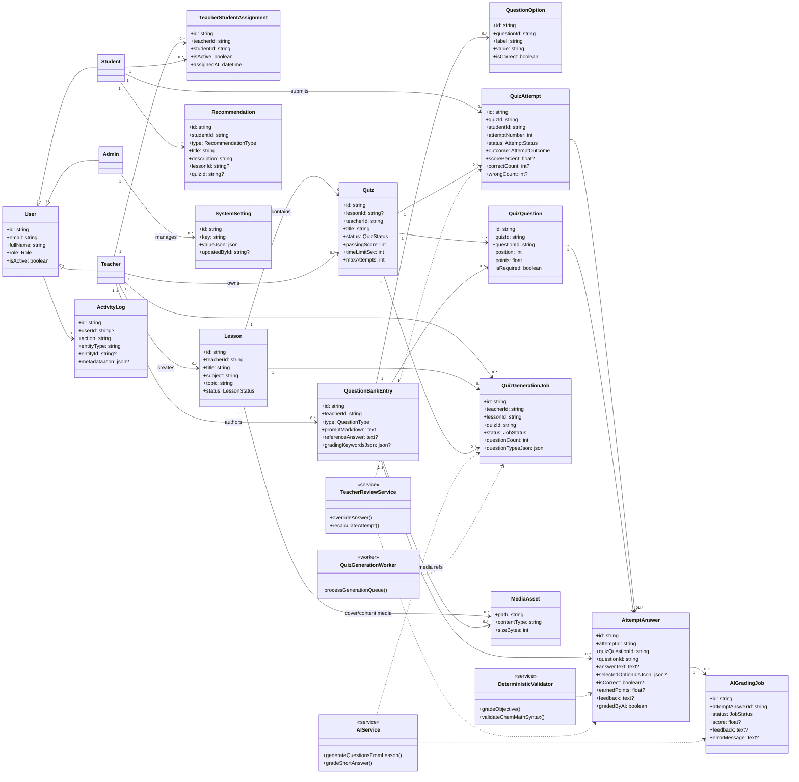

# ChemBalance UML Class Diagram (Current Implementation)

This diagram is aligned to the current ChemBalance implementation and replaces the outdated model that used `Assignment` and modeled `AI` as an entity.

- `Assignment` is removed.
- `AI` is represented as services/infrastructure, not a core domain class.
- `ChemicalEquation` is represented as a question/grading concern (via question type + validator), not a top-level aggregate.

